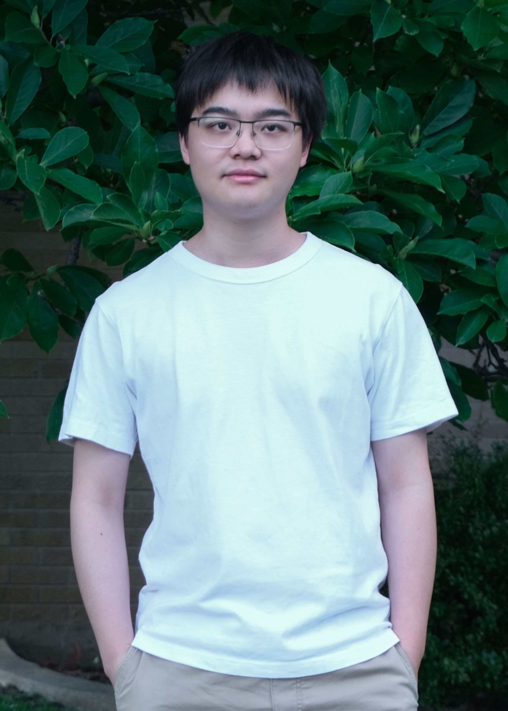

## About Me

I am currently majoring in **computer science** and pursuing the Ph.D. degree at the Department of Electrical Engineering and Computer Science, **Syracuse University**.

> Email: zxu105@syr.edu
>
> [Google Scholar](https://scholar.google.com/citations?user=jKHMVnYAAAAJ&hl=en)
>
> [Linkedin](https://www.linkedin.com/in/zhiyuan-xu-19a66191)

## Research Interest

Deep Learning, Deep Reinforcement Learning, Mobile Computing and Communication Networks.

## Experience

- **Research Intern**, \\
  DiDi Ai Labs, \\
  Sep 2018 - Jun 2019, Beijing City, China

- **Research Assistant**, \\
  Syracuse University, College of Engineering and Computer Science, \\
  Aug 2015 - Present, Syracuse, New York, USA.  

## Education

Year | Degree | University
:-----:|:--------:|:-----------
2015 - Present | Ph.D. Candidate | Syracuse University
2015 | Exchange | Dalhousie University
2013 | Exchange | National Taiwan University of Science and Technology
2011 - 2015 | B.S. | University of Electronic Science and Technology of China
